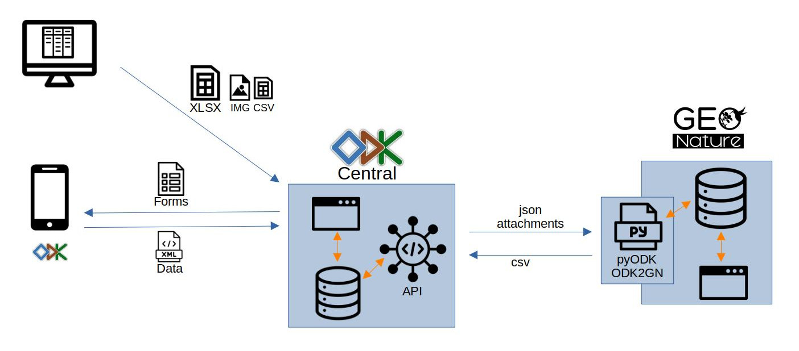
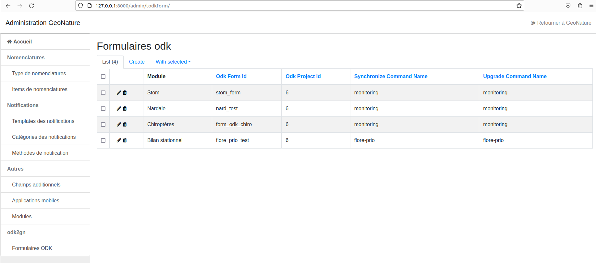

# ODK Central to GeoNature

ODK2GN est un module python utilisant les modèles de GeoNature pour intégrer des données depuis l'API d'ODK Central vers la base de données de GeoNature, en utilisant pyodk.

Il permet actuellement d'importer des données collectées avec ODK vers le module Monitoring de GeoNature et de mettre à jour les listes de valeurs du formulaire ODK en fonction des données de la base de données GeoNature, en se basant sur les fichiers de configuration du module Monitoring.

Il est aussi possible d'utiliser ODK2GN pour créer des formulaires mobiles de saisie dans d'autres modules de GeoNature, comme l'exemple du module [Flore prioritaire](https://github.com/PnEcrins/odk2gn_flore_prioritaire).

Première version développée dans le cadre du workshop ODK des parcs nationaux de France et de l'OFB (Décembre 2022) : https://geonature.fr/documents/2022-12-PNX-OFB-Workshop-ODK.pdf

## Architecture



## Installation

Bien qu'indépendant, l'installation de ce module se fait dans l'environnement de GeoNature.

```sh
# Activation du virtual env de GeoNature
source <path_vers_gn>/backend/venv/bin/activate
```

### Installation des modules

- Copier le fichier odk2gn_config.toml.example dans le dossier /config de la version de GeoNature installée avec la série de commandes suivantes:
  ```sh
  cp odk2gn_config.toml.example <path_vers_gn>/config/odk2gn_config.toml
  geonature install-gn-module <chemin vers odk2gn> --build=false
  ```

## Configuration

### ODK central

Renseigner les paramètres de connexion au serveur ODK Central, pour `pyODK` (https://github.com/getodk/pyodk)

```
[central]
base_url = "https://odk-central.monserveur.org"
username = "username"
password = "password"
default_project_id = 1
```

### Tâches de fond

Il est possible de faire tourner des tâches de synchronisation automatique de la base de données et de mise à jour des fichiers CSV des formulaires en tâches de fond.

À ces fins, des chaines de caractères comme ceux dans un cron, `synchronize_schedule` pour la synchronisation de la base, et `upgrade_schedule` pour la mise à jour des fichiers. Les chaines sont de la forme `* * * * *`. Le premier élément représente les minutes, le deuxième les heures, le troisième le jour de la semaine, le quatrième le jour du mois, et le cinquième le mois de l'année. Pour en savoir plus sur ce qu'il est possible d'écrire pour remplir ces chaines, veuillez consulter le site https://docs.celeryq.dev/en/stable/reference/celery.schedules.html#celery.schedules.crontab.

**ATTENTION** L'heure indiqué dans le crontab est en UTC.

### Modules monitoring

Les formulaires monitoring ODK doivent respecter le template xlsx de monitoring fourni avec ce dépôt. Ce template crée des formulaires dont les noms de champs respectent la structure de donnée de destination de la base de données GeoNature (pour les champs génériques des visites et observations). Tous les champs qui ne "matchent" pas ces correspondances seront poussés comme champ spécifique au format json. Il existe deux versions de ce template, une avec l'option de création de sites, et une sans.

Actuellement, les champs suivants sont configurables et peuvent être différents de la structure défini par le template xlsx :

- le code du module. Champ `module_code`
- le nom du champ "booléen" indiquant si des sites sont crées. Champ `create_site`
- Au niveau des sites : 

  - le nom du champ contenant le nom du site. Champ `base_site_name` 
  - le nom du champ contenant la description du site. Champ `base_site_description`
  - le nom du champ contenant l'id dans la base de l'utilisateur qui a créé le site. Champ `id_inventor`
  - le nom du champ contenant la date de première utilisation du site. Champ `first_use_date`
  - le nom du champ contenant les données géographiques du site. Champ `geom` 
  - le nom du champ qui porte le nom du groupe où figurent les champs additionnels. Champ `data`

- Au niveau de la visite :

  - le nom du "noeud" de la boucle (repeat) contenant les observateurs. Champ `observers_repeat`
  - le nom du champ contenant l'id_role du noeud "observers_repeat". Champ `id_observer`
  - le nom du champ contant le commentaire. Champ `comments`
  - le nom du champ contenant le média. Champ `media`
  - le type média. Champ `media_type`

- Au niveau de l'observation :
  - le nom du "noeud" de la boucle repeat contenant les observations. Champ `observations_repeat`
  - le nom du champ contant le commentaire. Champ `comments`
  - le nom du champ contenant le média. Champ `media`
  - le type média. Champ `media_type`

Exemple du protocole STOM (cette configuration correspond à la configuration par défaut et n'a pas besoin d'être spécifiée).

```
[[modules]]
    module_code = "STOM"
    # booléen indiquant la création de sites
    create_site="create_site"
    [modules.SITE]
        # nom du champ nom du site
        base_site_name = "site_name"
        # nom du champ description du site
        base_site_description = "base_site_description"
        # nom du champ definissant l'inventeur du site
        id_inventor = "observers"
        # nom du groupe contenant les champs additionnels
        data = "site_creation"
        # nom du champ de date de première utilisation du site
        first_use_date = "visit_date_min"
        # nom du champ de geométrie
        geom = "geom"
    [modules.VISIT]
        # nom du champ commentaire de la visite (optionnel, defaut comments_visit)
        comments = "comments_visit"
        # nom du champ média de la visite (optionnel, defaut medias_visit)
        media = "medias_visit"
        # nom du du noeud d'accès au tableau d'observateur (optionnel, defaut 'observer')
        observers_repeat = 'observer'
        # nom de la clé contenant l'id_role du noeud "observers_repeat" (optionnel, defaut 'id_role')
        id_observer = 'id_role'
        # type du media (optionnel, defaut "Photo" - valeur possible "Photo", "PDF", "Audio", "Vidéo (fichier)" )
        media_type = "Photo"
    [modules.OBSERVATION]
        # nom du noeud repeat d'accès au tableau d'observations (optionnel, defaut : 'observations')
        observations_repeat = "observations"
        # nom du champ commentaire de l'observation (optionnel, defaut comments_observation)
        comments = "comments_observation"
        # nom du champ média de la visite (optionnel, defaut medias_visit)
        media = "medias_observation"
        # type du media (optionnel, defaut "Photo" - valeur possible "Photo", "PDF", "Audio", "Vidéo (fichier)" )
        media_type = "Photo"
```

Pour ajouter un autre module monitoring dans la config, il faut ajouter dans le fichier `odk2gn_config.toml` un nouvel élément ```[[modules]]```, contenant au minimum le code du module, ainsi que tous les champs du formulaire pour le nouveau module au niveau des niveaux implémentés. Ces niveaux doivent être dans des balises `[modules.(SITE/VISITE/OBSERVATION)]`.

## Templates et exemples de formulaires

Deux templates de formulaire au format XLSX sont fournis dans le dossier ``/odk_template_form``, un avec la possibilité de créer des sites, et un sans. Ils permettent d'avoir la structure de base de définition d'un formulaire compatible avec le module Monitoring de GeoNature et la structure de données attendue par ODK2GN.

Des exemples fonctionnels de formulaires sont aussi disponibles dans les dossiers d'exemples de protocoles de Monitoring :

- https://github.com/PnX-SI/protocoles_suivi/tree/master/chiro/odk_form
- https://github.com/PnX-SI/protocoles_suivi/tree/master/stom/odk_form

## Mise en place de la synchronisation automatique des formulaires

À chaque fois qu'un nouveau formulaire est passé à ODK Central, si on veut l'utiliser avec GeoNature, il faut créer un nouvel objet odk_form. Pour ceci, il faut lancer GeoNature, puis aller dans le menu admin, puis dans l'option "BackOffice GeoNature". Ensuite, il faut entrer dans le volet "Formulaires ODK".



Une fois arrivé.e ici, cliquer sur le bouton "Create", puis remplir le formulaire.

**ATTENTION** : Bien veiller à faire tout ce qui suit correctement.
 
 - Bien sélectionner le module qui correspond au formulaire.
 - L'ODK Form Id doit **obligatoirement** correspondre à celui dans le menu settings du formulaire xlsx.
 - L'ODK Project Id doit être le celui où figure le formulaire dans ODK Central
 - Les champs de nom de commande Synchronize et Upgrade doivent être remplis avec **monitoring** dans le cas d'un module monitoring.

Une fois que ceci est fait, cliquer sur "save".


## Commandes

Avant de lancer une commande, il faut s'assurer d'être dans le virtualenv de l'application GeoNature :

```sh
source <path_vers_gn>/backend/venv/bin/activate
```

### Synchronisation des données de ODK vers GeoNature

Permet de récupérer les données saisies dans ODK central via ODK collect ainsi que les médias associés.

De façon à distinguer les données intégrées en base, de celles non traitées le module opère une modification de la métadonnées `reviewState`.

Une fois une soumission intégrée en base son `reviewState` est modifiée en `approved`. Si l'insertion dans GeoNature ne peut se faire la soumission est marquée en `hasIssues`. De cette façon l’administrateur de données peut traiter manuellement la données problèmatique via enketo.

```sh
geonature odk2gn synchronize monitoring <MON_CODE_MODULE> --form_id=<ODK_FORM_ID> --project_id=<ODK_PROJECT_ID>
```

### Mise à jour du formulaire ODK

Publie sur ODK central une nouvelle version du formulaire avec une mise à jour des médias à partir des données de GeoNature. Les données envoyées sont :

- liste des sites
- liste des taxons
- liste des observateurs
- liste des jeux de données
- liste des nomenclatures
- liste des groupes de sites

```sh
geonature odk2gn upgrade-odk-form monitoring <MON_CODE_MODULE> --form_id=<ODK_FORM_ID> --project_id=<ODK_PROJECT_ID>
```

Des options permettent de ne pas synchroniser certains types de données :

- `--skip_taxons` : ne pas générer le fichier des taxons
- `--skip_observers` : ne pas générer le fichier des observateurs
- `--skip_jdd` : ne pas générer le fichier des jeux de données
- `--skip_sites` : ne pas générer le fichier des sites
- `--skip_nomenclatures` : ne pas générer le fichier des nomenclatures
- `--skip_sites_groups` : ne pas générer le fichier des groupes de sites


## Sous-modules hors Monitoring

Certains modules GeoNature implémentant des protocoles qui ne sont pas des protocoles monitoring peuvent être implémentés avec ODK2GN.

Pour ceci, ces modules ont besoin de deux entry-points dans le fichier `setup.py`, un pour la commande `synchronize` et un pour la commande `upgrade-odk-form`.

La création des objets odk_form dans le volet admin se fait exactement de la même manière, sauf que les commandes de synchronisation et de mise à jour des formulaires ne s'appellent pas "monitoring", mais le nom indiqué dans le fichier où ces fonctions sont définies pour ce sous-module.

Voici un example de code de `setup.py` pour le module flore prioritaire (https://github.com/PnEcrins/odk2gn_flore_prioritaire) :

```python
import setuptools
from pathlib import Path


root_dir = Path(__file__).absolute().parent
with (root_dir / "VERSION").open() as f:
    version = f.read()

setuptools.setup(
    name="odk_flore_prioritaire",
    version=version,
    description="Flore prioritaire ODK project",
    maintainer="PNE",
    # url='https://github.com/PnX-SI/gn_module_monitoring',
    packages=setuptools.find_packages("src"),
    package_dir={"": "src"},
    tests_require=[],
    entry_points={
        "gn_odk_contrib": [
            "synchronize=odk_flore_prioritaire.main:synchronize",
            "upgrade_odk_form=odk_flore_prioritaire.main:upgrade_odk_form",
        ]
    },
    classifiers=[
        "Development Status :: 1 - Planning",
        "Intended Audience :: Developers",
        "Natural Language :: English",
        "Programming Language :: Python :: 3",
        "Programming Language :: Python :: 3.4",
        "Programming Language :: Python :: 3.5",
        "Programming Language :: Python :: 3.6",
        "Programming Language :: Python :: 3.7",
        "Programming Language :: Python :: 3.8",
        "License :: OSI Approved :: GNU Affero General Public License v3"
        "Operating System :: OS Independent",
    ],
)
```
