# Mode d'emploi ODK Collect

ODK Collect est une application mobile qui sert a remplir un formulaire. Nous l'utilisons dans le cadre de certains protocoles scientifiques d'observation de taxons de faune et de flore.

## Menu principal

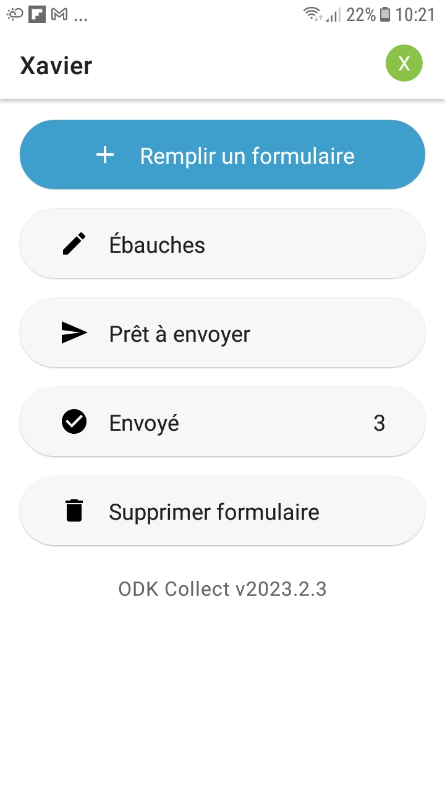

Le bouton **Remplir un formulaire** permet de choisir un modèle de formulaire à remplir.

Le bouton **Ébauches** contient les entrées de formulaires enregistrés mais qui ne sont pas envoyés car pas nécéssairement terminés.

Le bouton **Envoyé** permet de visualiser les formulaires envoyés

Le bouton **Supprimer le formulaire** permet de supprimer un formulaire envoyé ou une ébauche.

Si l'on appuye sur l'initiale en haut à droite, nous pouvons changer d'utilisateur ODK, dans le cas ou plusieurs utilisateurs seraient chargés sur un même téléphone ou tablette. Les utilisateurs ODK n'ont pas forcément tous les mêmes listes disponibles.

## Remplir un formulaire

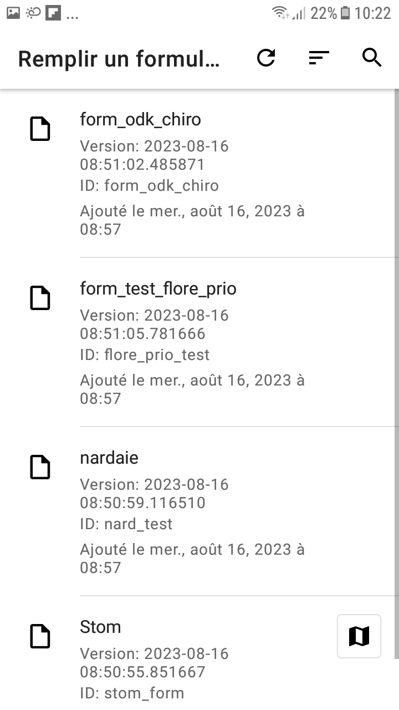

Dans ce menu est affiché une liste de modèles de formulaire. Appuyer sur une entrée crée un nouveau formulaire. 

Parmi les trois boutons en haut, la flèche circulaire permet de télécharger les dernières version de chaque formulaire, les trois lignes permettent de trier la liste par ordre alphabétique, par date de sortie de version, ou par ordre de dernière sauvegarde. Le bouton à droite en forme de loupe permet de rechercher un modèle de formulaire par son nom.

### Types de donnés à saisir

Les données peuvent être de plusieurs types différents. 

Certaines données à rentrer sont juste du texte ou un chiffre à saisir sur le clavier. Le clavier adapté sera affiché sur l'écran.

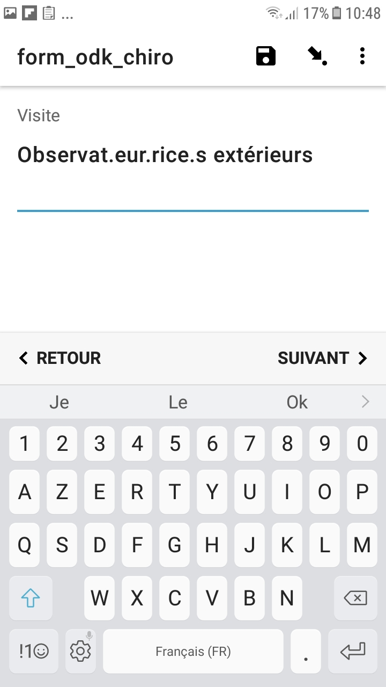 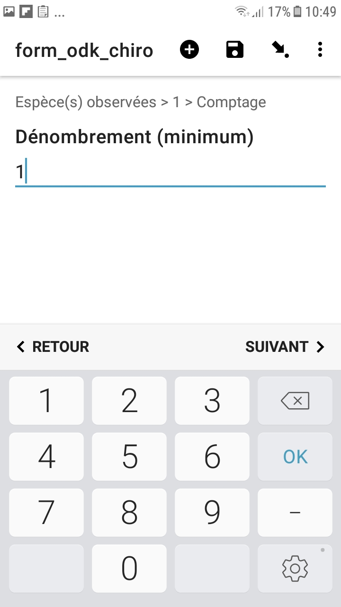

Pour les dates, un écran avec le bouton **"Choisir la date** sera affiché. Le choix par défaut est la date actuelle. Si l'on applye dessus, un calendrier sur lequel la date peut être choisie sera affiché. Les dates dans le futur ne sont pas des valeurs valides actuellement.

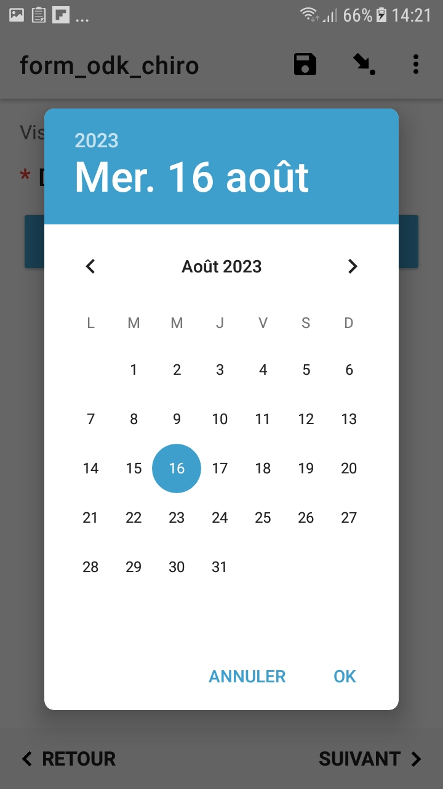

Pour certaines données, il faut choisir une (ou plusieurs) options parmi une liste. Si le bouton dans la liste est circulaire, un seul choix est possible dans la liste. S'il est de forme carré, plusieurs valeurs sont possibles. S'il y a une seule option de forme carrée, c'est une question vrai ou faux, avec la valeur "vrai" étant le cas ou la case est cochée, la valeur "faux" est quand elle est laissée vide.  Dans la plupart des champs comme ceci, il y a une barre de recherche afin de trouver le bon choix. Il y a également la possibilité pour certaines questions de choisir une valeur sur une carte. 

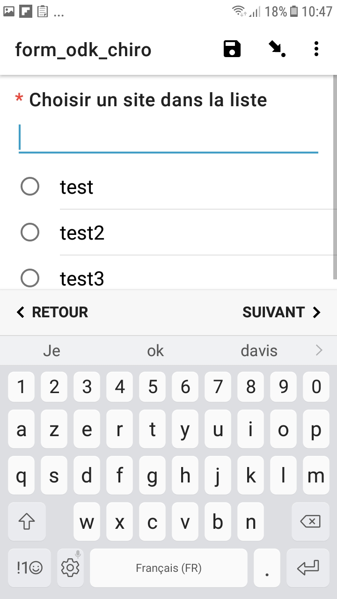   

Certaines données sont des données géographiques. Ils peuvent être de type point ou polygone. Ils seront saisis sur une carte. 

Dans le cas d'un point, il faut d'abord appuyer sur **Démarrer le point**. Pour saisir un point, il faut appuyer longuement sur l'écran, ou utiliser le bouton avec le marqueur contenant un +. Appuyer sur le bouton du haut permet de centrer l'écran sur le lieu où le GPS du téléphone à détecté qu'il est. Appuyer sur le deuxième permet de changer le fond de carte. Une fois qu'un point est saisi, le bouton avec la poubelle supprime le point (et il faut utiliser le bouton directement au-dessus pour en saisir un nouveau), et le bouton bleu avec la disquette permet d'enregistrer le point et de revenir au formulaire.

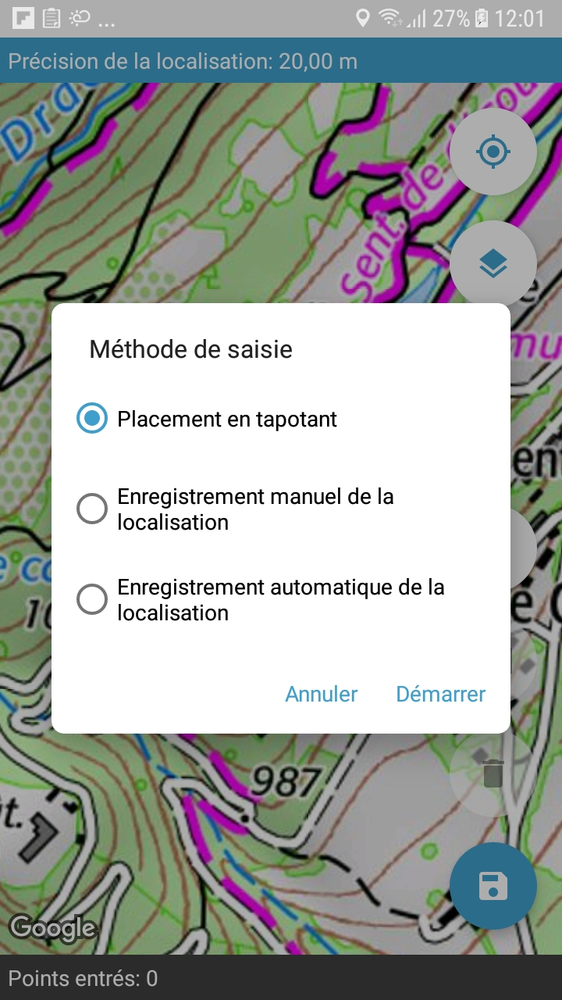

Dans le cas d'un polygone nous avons les mêmes boutons que pour un point. Pour en saisir, appuyer sur le bouton **Démarrer le polygone**, et puis appuyer sur le bouton avec le marqueur contenant un +, puis choisir le mode de saisie des points. Il est **vivement conseillé** de choisir l'option "Placement en tapotant", étant la méthode la plus fiable. Le mode "placement automatique place un point là où est le téléphone tous les 20 secondes, et pour placement manuel, à chaque fois que l'utilisateur appuye sur le bouton **Enregistrer un point**, un point est saisi sur la localisation du téléphone.
Pendant la saisie en tapotant, le bouton pause arrête la saisie de points, et le bouton avec la croix supprime le dernier point saisi.

 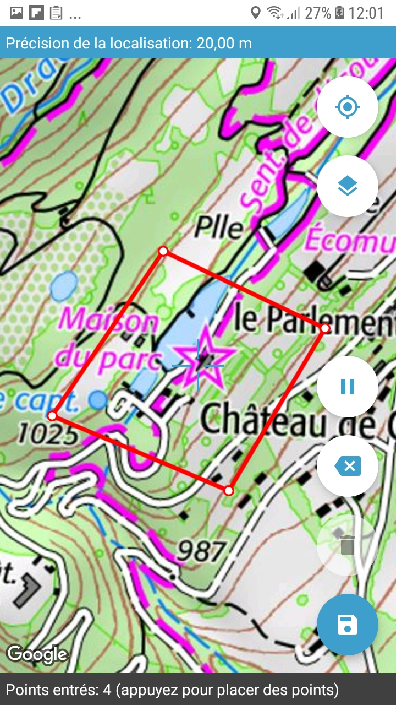

Certaines questions sont dans des groupes circulaires, c'est à dire que les mêmes questions peuvent être posés pour plusieurs éléments différents.Un popup va apparaître pour demander si vous voldrez ajouter un autre élément. Si oui, cliquer sur ajouter, sinon, appuyer sur ne pas ajouter.

À la fin du formulaire, il peut être enregistré comme ébauche, ou envoyé à la plateforme en ligne à laquelle l'application est liée.

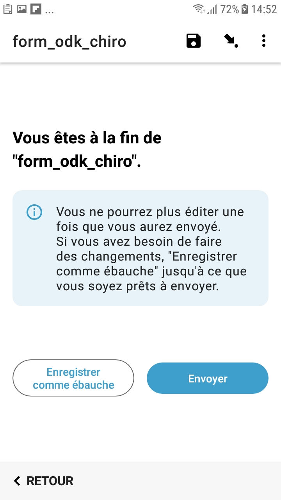

### Options pendant la saisie

Pendant la saisie du formulaire, il y a plusieurs boutons pour changer ce qui est affiché à l'écran. Le bouton **RETOUR** passe à l'écran précédent dans le formulaire, tandis que me bouton **SUIVANT** passe à l'écran suivant. Pour passer à une question en particulier appuyer sur le bouton du milieu en haut, et choisir dans le menu la question ou le groupe de questions désirée. Pour aller à une question dans un groupe, appuyer dans sur le groupe (ou groupe circulaire).
Le bouton avec la disquette permet d'enregistrer le formulaire dans l'état. Ainsi, dans le cas où l'on doit sortir de l'application, on peut le reprendre sans avoir à resaisir de données. Le bouton à trois points permet d'aller dans le menu des paramètres, mais ainsi de voir si les réponses données sont valides, ou s'il ne manque pas quelque chose d'important.Si l'on est dans un menu circulaire, il y a un bouton avec un + dessus qui permet de créer un nouveau passage dans la boucle, mais il est **vivement déconseillé** de l'utiliser.

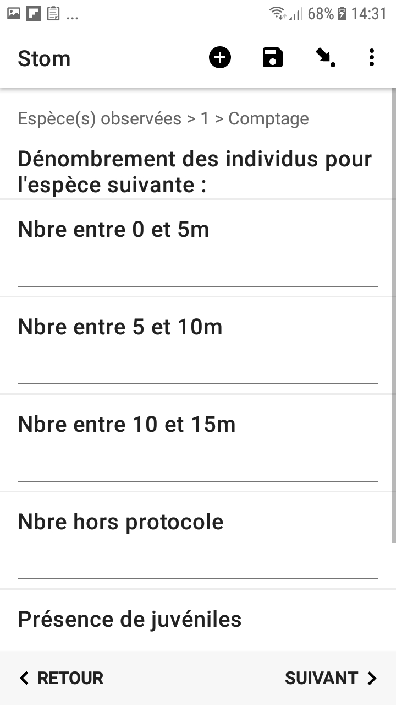

## Ébauches

Le menu **Ébauches** permet de choisir un formulaire enregistré et de le corriger ou de le compléter, exactement de la même manière que comme si l'on était allé dans le menu qui permet d'aller vers une question particulière.

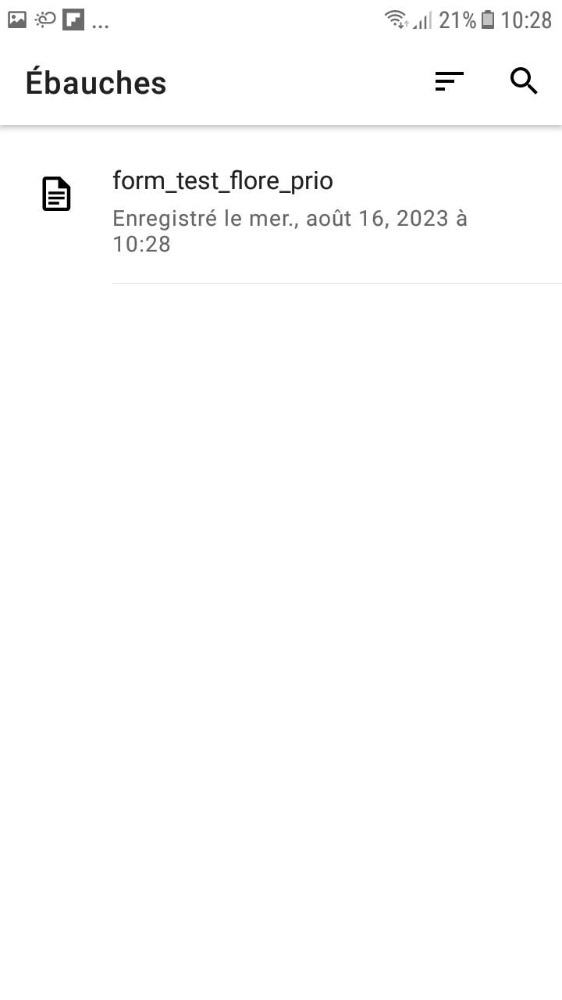

## Prêt à envoyer

Si l'on a rempli un formulaire et qu'on n'a pas de connection internet, le formulaire sera finalisé mais pas envoyé. Il est gardé ici jusqu'a que le téléphone aie de nouveau une connection internet, et est envoyé de manière automatique.

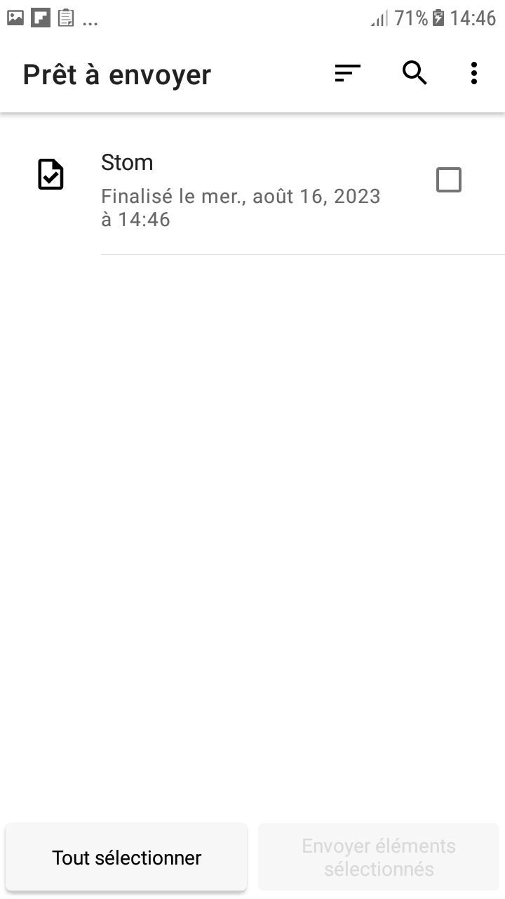

## Menu Envoyé

Le menu **Envoyé** permet de voir ce que contiennent les formulaires envoyés, et fonctionne exactement de la même manière que le menu **Ébauches**, sauf que l'on ne peut pas aller changer les valeurs.

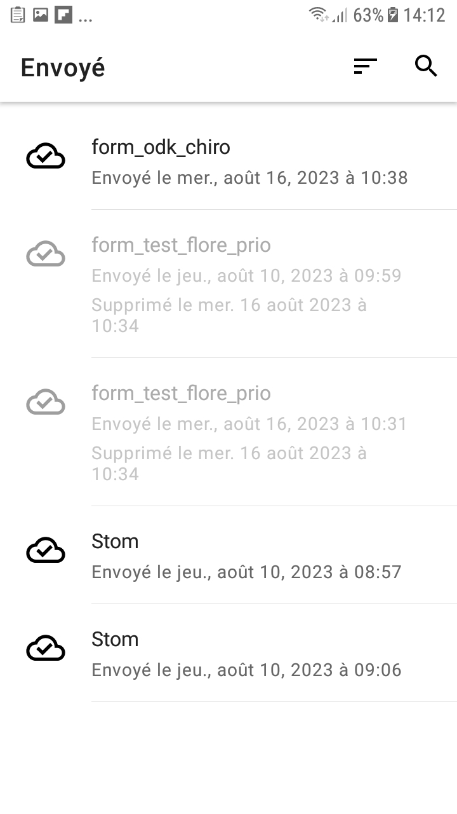

## Supprimer formulaires

Ce menu permet de supprimer des formulaires, qu'ils soient envoyés, finalisés ou en état d'ébauches.

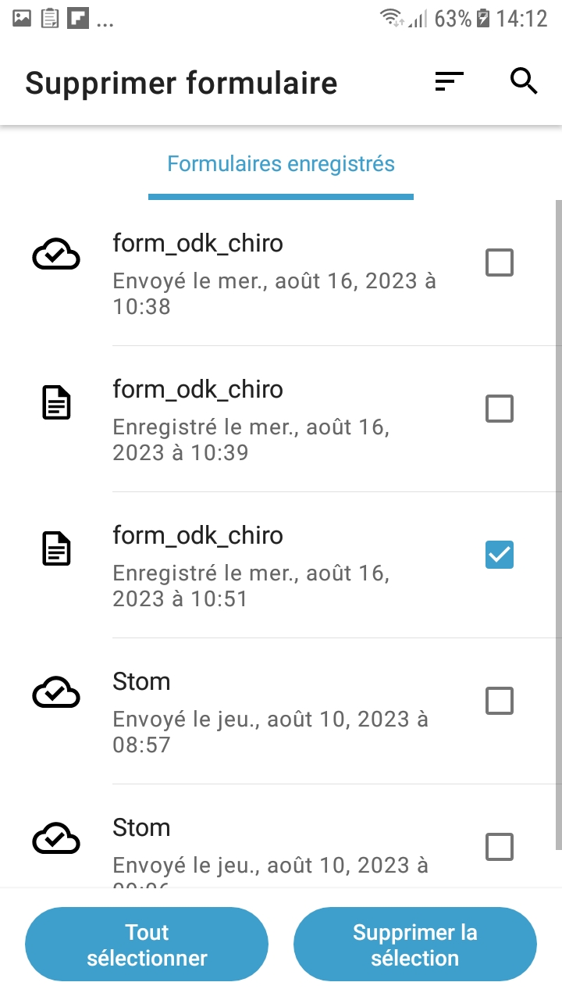
